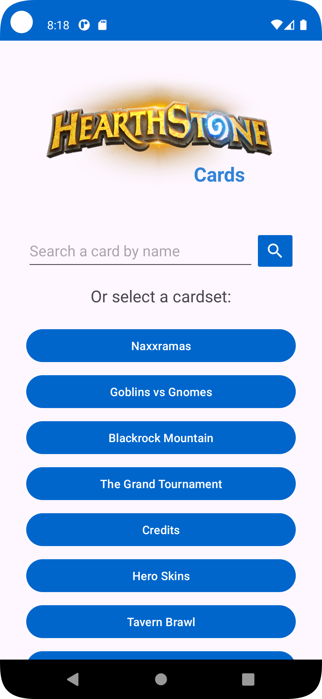
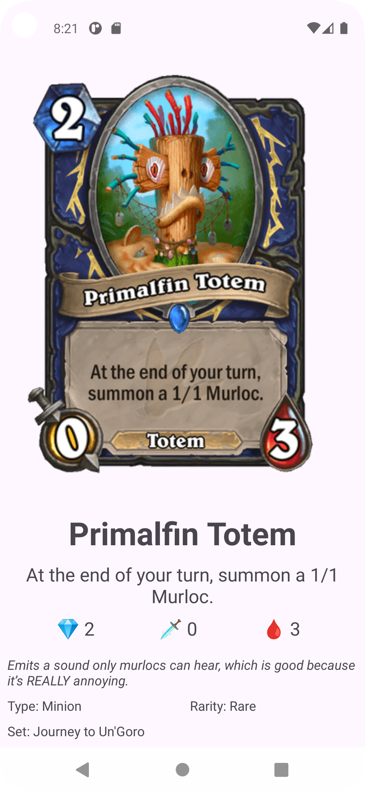

# Hearthstone Card Viewer 📜🃏

A simple Android application that allows users to browse and view details of Hearthstone cards. Powered by the Hearthstone API via [RapidAPI](https://rapidapi.com/).

---

## Features ✨
- **Search for Hearthstone cards by name**: Easily locate cards using a responsive search functionality.
- **Explore cards by card set**: Browse through Hearthstone card sets displayed in a clean and organized RecyclerView layout.
- **View detailed card information**: Access comprehensive details about selected cards, including high-resolution images and relevant stats.
- **Modern Android development practices**: Built with up-to-date tools and frameworks to ensure reliability, maintainability, and efficient performance.
---

## Screenshots 📸
<div>
  
  
  
</div>

---

## How to Use 🛠️

1. **Clone the repository**:
    ```bash
    git clone https://github.com/marcos-mobdev/kotlin-hearthstone-cards
    ```

2. **Setup API Key**:
    - Create an account or log in at [RapidAPI](https://rapidapi.com/auth/sign-up).
    - Subscribe to the Hearthstone API and obtain your API Key. [HearthstoneAPI](https://rapidapi.com/omgvamp/api/hearthstone)
    - Create a new Kotlin object named `Secret` in your project:

    ```kotlin
    object Secret {
        const val API_KEY = "your-api-key-here"
    }
    ```

    - Replace `"your-api-key-here"` with your actual API key.

3. **Run the app**:
    - Build and run the project in Android Studio.

---

## Technologies Used 🛠️

### Libraries & Tools
- **[Retrofit](https://square.github.io/retrofit/)**: For making HTTP requests.
- **[Picasso](https://square.github.io/picasso/)**: For image loading and caching.
- **[ViewModel](https://developer.android.com/topic/libraries/architecture/viewmodel)**: Lifecycle-aware UI-related data holder.
- **[LiveData](https://developer.android.com/topic/libraries/architecture/livedata)**: Observable data holder for UI updates.
- **[Hilt](https://dagger.dev/hilt/)**: Dependency injection for Android.

### Architecture
- **MVVM (Model-View-ViewModel)**: Ensures a clean separation of concerns and easy testing.

### Unit Testing 
- **[Truth](https://google.github.io/truth/)**: For fluent and readable assertions in unit tests.
- **[Mockito](https://site.mockito.org/)**: For mocking dependencies in unit tests.
- **[Coroutine Test](https://github.com/Kotlin/kotlinx.coroutines/tree/master/kotlinx-coroutines-test)**: For testing coroutines and ensuring proper asynchronous behavior.
- **[Core Testing](https://developer.android.com/training/testing)**: Android testing support library for handling lifecycle-aware components like `LiveData` and `ViewModel`.

### Instrumented Testing
- **[Espresso](https://developer.android.com/training/testing/espresso)**: For UI testing and ensuring the app's UI interacts correctly with the user.

---
## API Integration 🌐

The app integrates with the **Hearthstone API** via RapidAPI. This allows users to browse and view information about various Hearthstone cards.

### Endpoints Used:
- `/cards/info`: Retrieves a list of cardSet names
- `/cards/sets/{setCard}`: Retrieves a list of cards of the set.
- `/cards/search/{cardName}`: Search for card by name

---

## Contribution 🤝

Contributions are welcome!  
Feel free to open issues or submit pull requests.

---

## License 📄

This project is licensed under the MIT License. See the [LICENSE](LICENSE) file for more details.
